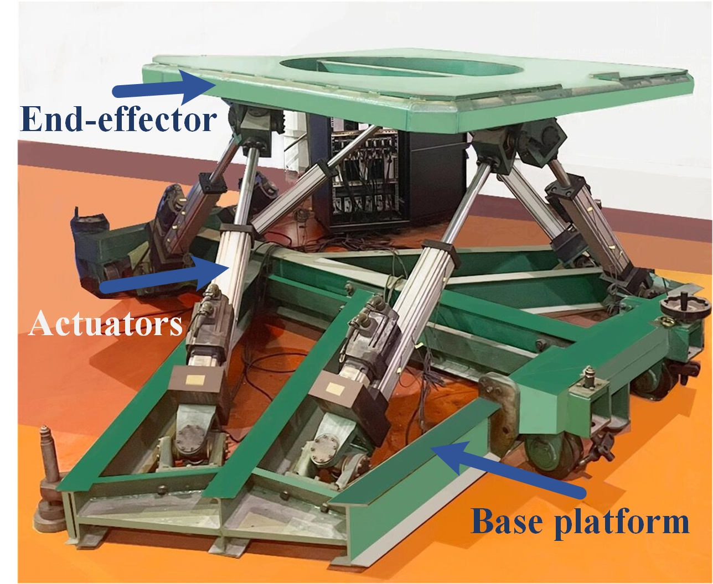
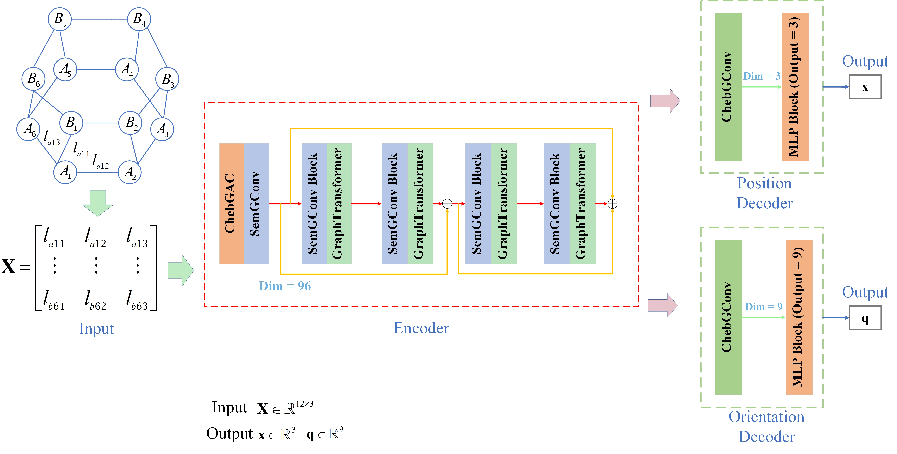
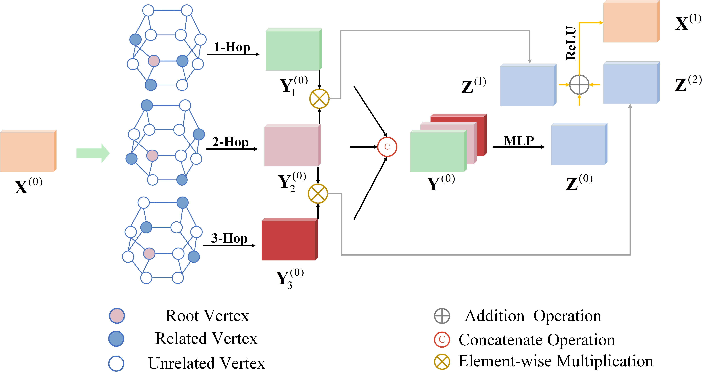
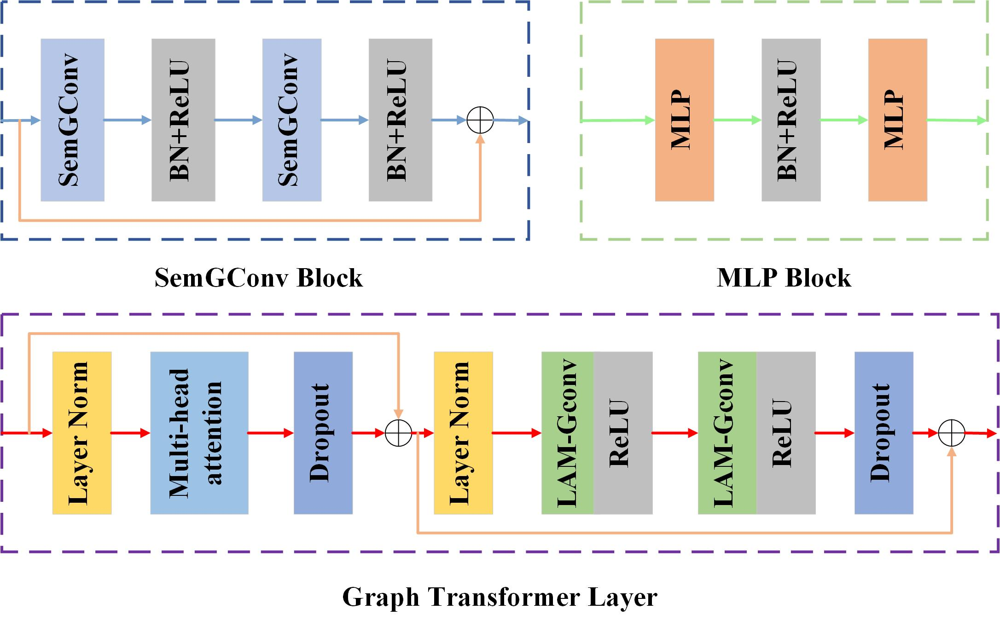

# Graph-Geometric Message Passing via a Graph Convolution Transformer for FKP Regression

Official PyTorch implementation of the paper
**"Graph-geometric message passing via a graph convolution transformer for FKP regression"**
*Science China Information Sciences*, Vol. 67, No. 12, Article 222202, 2024.

Huizhi Zhu, Wenxia Xu, Jian Huang, Baocheng Yu

---

## Overview

We address the **Forward Kinematics Problem (FKP)** of the **Gough-Stewart parallel platform** by formulating it as a graph regression task. The proposed **Graph Convolution Transformer (GCT)** combines Chebyshev graph convolution with a transformer-style attention mechanism, enabling joints and limbs of the platform to exchange both *local* and *long-range* geometric information for accurate end-effector pose estimation.

### Gough-Stewart platform
<div align="center"></div>

### Framework
<div align="center"></div>

### ChebGAC Layer
<div align="center"></div>

### Block architecture
<div align="center"></div>

---

## Repository Structure

```
GCT-FKP/
├── GCT.py             # Graph Convolution Transformer (main model)
├── ChebConv.py        # Chebyshev graph convolution layer
├── sem_graph_conv.py  # Semantic graph convolution layer
├── dataset.py         # Dataset loader
├── train.py           # Training entry point
├── tools.py           # Loss functions, rotation utilities, helpers
├── visualizer.py      # Result visualization
└── *.jpg              # Architecture figures
```

---

## Dependencies

| Package | Version |
|---|---|
| CUDA | 11.3 |
| Python | 3.9.13 |
| PyTorch | 1.11.0 |
| NumPy | 1.22.4 |

Quick install via `pip`:

```bash
pip install torch==1.11.0+cu113 torchvision==0.12.0+cu113 \
    --extra-index-url https://download.pytorch.org/whl/cu113
pip install numpy==1.22.4 scipy tensorboard torchsummary
```

---

## Dataset

We provide a dataset of Gough-Stewart platform configurations for training and evaluation.
Download from Kaggle:

> **GSP-FK Dataset** — <https://www.kaggle.com/datasets/huizhizhu/gsp-fkdataset>

Place the downloaded files in the project root (or update the path in `dataset.py`).

---

## Training

```bash
python train.py
```

Default hyperparameters used in the paper:

| Setting | Value |
|---|---|
| Batch size | 4000 |
| Epochs | 800 |
| Learning rate | 1e-3 |
| Output representation | 9D rotation |
| Loss | MSE + L1 (weighted) |

TensorBoard logs are written to `./logs`. Model checkpoints are saved periodically; adjust `save_epoch_freq` in `train.py` as needed.

---

## Citation

If you find this work useful, please cite:

```bibtex
@article{zhu2024graph,
  title={Graph-geometric message passing via a graph convolution transformer for FKP regression},
  author={Zhu, Huizhi and Xu, Wenxia and Huang, Jian and Yu, Baocheng},
  journal={Science China Information Sciences},
  volume={67},
  number={12},
  pages={222202},
  year={2024},
  publisher={Springer}
}
```

---

## Contact

For questions about the paper or code, please open an issue or contact the first author.